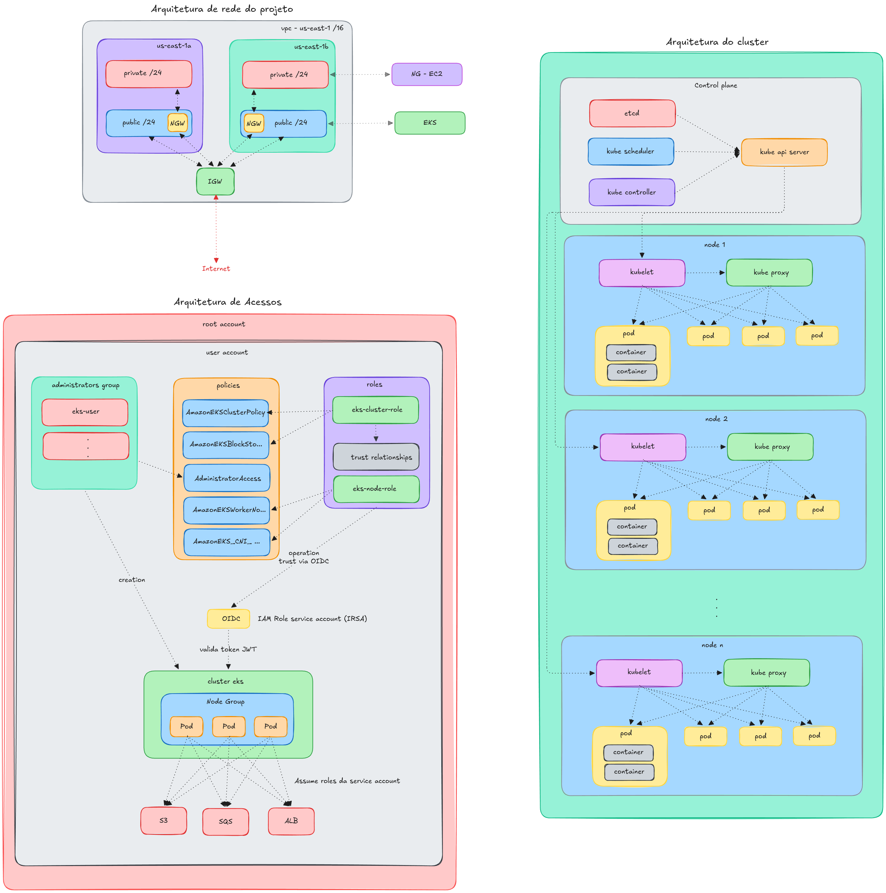
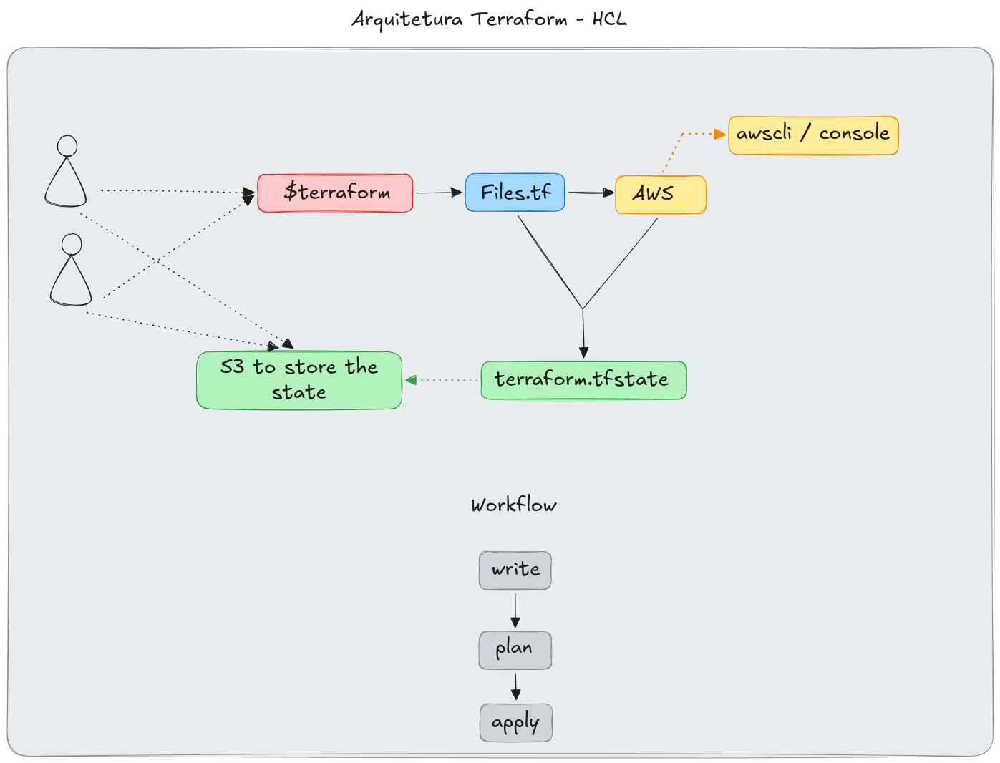

# Documentação

| Documento | Descrição |
|---|---|
| [terraform_workflow.md](terraform_workflow.md) | Fluxo de trabalho, comandos e boas práticas do Terraform |
| [eks_architecture.md](eks_architecture.md) | Arquitetura da AWS, VPC, EKS, OIDC e IAM |
| [cluster_creation.md](cluster_creation.md) | Criação do cluster, kubectl, OIDC provider e Load Balancer Controller |

## Diagramas

### Arquitetura EKS

[Editar diagrama](eks.excalidraw)

---

### Fluxo Terraform

[Editar diagrama](terraform.excalidraw)
